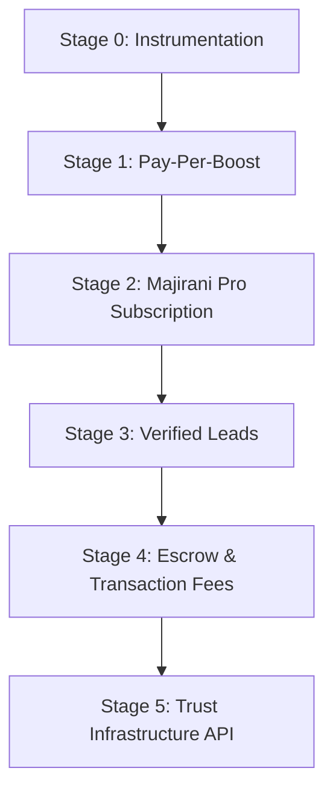

# Majirani monetization Plan

This document details the staged monetization roadmap for the Majirani Skills platform, translating our trust-based system into sustainable revenue streams.

---

## The Underlying Principle

> [!IMPORTANT]
> **Trust is the asset.**
> We are not a marketplace with a trust feature bolted on. We are a trust system that happens to have a marketplace UI.
> 
> Therefore, we charge for **confidence backed by data**, not access to artisans. Access is free on WhatsApp or Facebook; certainty is our unique moat.

---

## Staged Roadmap

### Stage 0 — Free, but Instrumented (Current Focus)
Before charging anyone, we must capture the validation data that justifies the first price tag.
- **Trigger**: Launching the platform.
- **Goal**: Track artisan visibility.
- **Action**: Log profile views, search impressions, "contact artisan" clicks, and repeat client visits as real events tied to artisan IDs.
- **Monetization Link**: This telemetry powers the Stage 2 pitch ("You have 54 views this month, pay to see who and act on it").

### Stage 1 — Pay-Per-Boost (Cheap Revenue Test)
Test willingness to pay with low-cost micro-transactions before building a full subscription billing system.
- **Trigger**: Initial user traction (100+ active artisans).
- **Cost**: KES 20 – 50 (one-off).
- **Deliverable**: Boost one listing in the artisan's **Active Services Manager** to the top of category searches for 48 hours.
- **Action**: Integrate M-Pesa STK push prompt directly next to the services manager UI.
- **Moat vs WhatsApp**: WhatsApp groups have no "top of search" position or local relevance ranking.

### Stage 2 — Majirani Pro Subscription (Core Non-Dangerous Revenue)
An all-inclusive premium tier for master artisans seeking professional growth.
- **Trigger**: Artisans are getting countable profile views/saves but have no tool to convert them.
- **Cost**: TBD via cohort price-testing (candidates: KES 300 / 500 / 800 per month).
- **Included Features**:
  1. **Trust Score Analytics**: Show who viewed their profile.
  2. **Priority Placement**: Higher weight in client searches.
  3. **Verification Priority**: Jump to the front of the ID approval queue.
  4. **Expanded Showcase**: Upload up to 30 portfolio items (free tier capped at 5).
  5. **Reputation Timeline Export**: Generate a signed PDF report of verified milestones for tender/loan applications.
- **Moat vs WhatsApp**: WhatsApp cannot show analytics, verify identity documents, or generate official reputation reports.

### Stage 3 — Verified Leads
Transition to charging for direct connections once demand is proven.
- **Trigger**: Stage 2 conversion stabilizes.
- **Cost**: KES 50 – 200 per contact initiation.
- **Safeguards**:
  - **Lead-Quality Score**: Verifying client match, location accuracy, and contact activity before charging.
  - **Refund-Credit System**: Automatic or low-touch credits for spam, false numbers, or complete no-shows (capped monthly to prevent abuse).

### Stage 4 — Escrow & Transaction Fees (3–5%)
The highest leverage per transaction, but carries regulatory weight.
- **Trigger**: Extended completed-job history and high client confidence in platform-mediated payments.
- **Mechanics**: Hold client payments via M-Pesa Daraja API, releasing funds to the artisan upon digital job sign-off.
- **Regulatory Caution**:
  > [!WARNING]
  > Holding third-party escrow funds in Kenya falls under Central Bank of Kenya (CBK) payment service provider guidelines. A legal consultation or partnership with a licensed payment processor is required before shipping this feature.

### Stage 5 — Trust Infrastructure (B2B API Access)
Selling API access to risk data, verification status, and reputation scoring.
- **Trigger**: Platform grows to thousands of verified artisans with deep transaction history.
- **Customers**: Lenders (tool finance), micro-insurers, and commercial construction firms.
- **Immediate Action**: Partner with local hardware stores to offer store discounts to "Verified Artisans" in exchange for a signup referral fee.

---

## Feature Mapping

| Already Built Feature | Monetization Lever Unlocked | Stages Affected |
| :--- | :--- | :--- |
| **Trust Score Engine & TrustEvent Log** | Premium analytics, risk-scoring API, log transparency | Stage 2, Stage 5 |
| **ID Verification Queue** | Paid priority queue jump, Verification-as-a-Service | Stage 2, Stage 5 |
| **Profile Views Counter** | Core "see who's looking" upsell | Stage 2 |
| **Reputation Timeline** | Shareable reports for tenders and bank loans | Stage 2, Stage 5 |
| **Active Services Manager** | Pay-per-boost listings | Stage 1 |
| **Admin Stats Endpoint** | Needs extension: Track MRR, Lead conversion, and Churn | Internal Operations |

---

## 5-Question Framework for Stage 2 (Majirani Pro)

1. **Who pays?**
   - The artisan, not the client.
2. **Why do they pay?**
   - To convert visible search rank and profile interest into high-paying bookings faster than competitors.
3. **When do they pay?**
   - Monthly, recurring subscription.
4. **How much do they pay?**
   - Set dynamically by cohort price-testing, anchored to the value of securing one extra job per month.
5. **Why not just use WhatsApp or Facebook?**
   - Neither platform offers location-ranked search, verified identity badges, structured reviews, or analytics showing who is looking.
